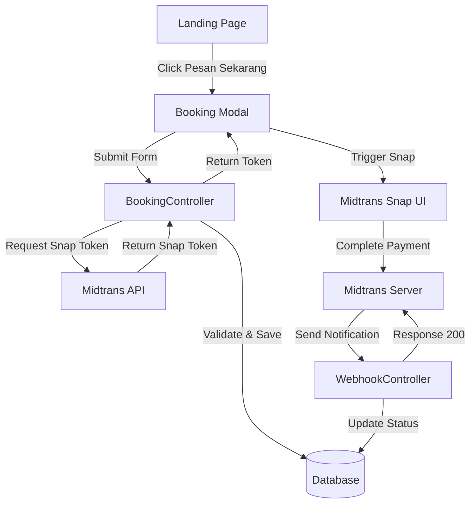
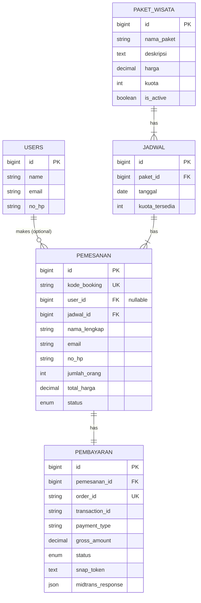

# Design Document: Booking & Payment with Midtrans Integration

## Overview

This design document outlines the architecture and implementation strategy for the Booking & Payment system with Midtrans Sandbox integration for the Godong Ijo (The Waterfall) landing page. The system enables visitors to book tour packages and complete online payments without requiring user authentication, providing a seamless booking experience directly from the landing page.

### Key Features

- **Guest Checkout**: No login/registration required for booking
- **Real-time Payment Processing**: Integration with Midtrans Snap API for multiple payment methods
- **Webhook Notifications**: Automated payment status updates via Midtrans webhooks
- **Form Validation**: Client-side and server-side validation for data integrity
- **Responsive UI**: Modal-based booking form with loading states and user feedback
- **Database Persistence**: Comprehensive tracking of bookings and payment transactions

### Technology Stack

- **Backend**: Laravel 10.x (PHP 8.1+)
- **Payment Gateway**: Midtrans Snap API (Sandbox mode)
- **Frontend**: Blade templates with Alpine.js for interactivity
- **Database**: MySQL with migrations for schema management
- **HTTP Client**: Guzzle for API communication

## Architecture

### System Architecture

The system follows a Model-View-Controller (MVC) architecture with external payment gateway integration:



### Data Flow

1. **Booking Initiation**: User clicks "Pesan Sekarang" → Modal opens with pre-filled package info
2. **Form Submission**: User fills form → Frontend validates → AJAX POST to backend
3. **Token Generation**: Backend creates booking record → Requests Snap token from Midtrans → Returns token to frontend
4. **Payment Processing**: Frontend triggers Midtrans Snap → User completes payment → Midtrans processes transaction
5. **Status Update**: Midtrans sends webhook notification → Backend verifies & updates status → Responds with 200 OK

### Security Considerations

- **CSRF Protection**: Laravel's CSRF token validation for all booking form submissions
- **Webhook Signature Verification**: Midtrans signature validation to prevent fake notifications
- **Input Sanitization**: Laravel validation rules and Eloquent ORM for SQL injection prevention
- **Environment Variables**: Sensitive credentials stored in `.env` file
- **Sandbox Mode**: Development and testing use Midtrans sandbox environment

## Components and Interfaces

### Frontend Components

#### 1. Booking Modal Component

**Location**: `resources/views/components/booking-modal.blade.php`

**Responsibilities**:
- Display modal overlay with form
- Handle modal open/close interactions
- Manage body scroll lock when modal is active
- Pre-fill package information

**Props**:
```php
@props([
    'packages' => [], // Array of available packages
])
```

**Events**:
- `booking-modal:open` - Opens modal with package data
- `booking-modal:close` - Closes modal and cleans up

#### 2. Booking Form Component

**Location**: Embedded within booking modal

**Responsibilities**:
- Collect user input (name, email, phone, date, quantity)
- Client-side validation with real-time feedback
- Calculate total price dynamically
- Submit form data via AJAX
- Handle loading states and errors

**Fields**:
- `nama_lengkap` (string, min: 3 chars)
- `email` (email format)
- `no_hp` (string, 10-15 digits)
- `paket_wisata_id` (integer, readonly)
- `tanggal_kunjungan` (date, >= today)
- `jumlah_orang` (integer, 1-100)
- `total_harga` (calculated, readonly)

**JavaScript Integration**:
```javascript
// Using Alpine.js for reactive form handling
Alpine.data('bookingForm', () => ({
    form: {
        nama_lengkap: '',
        email: '',
        no_hp: '',
        paket_wisata_id: null,
        tanggal_kunjungan: '',
        jumlah_orang: 1
    },
    loading: false,
    errors: {},
    totalHarga: 0,
    
    calculateTotal() {
        // Calculate total price based on quantity
    },
    
    async submitBooking() {
        // AJAX submission with error handling
    }
}))
```

#### 3. Midtrans Snap Integration

**Location**: `resources/js/midtrans-snap.js`

**Responsibilities**:
- Load Midtrans Snap.js library
- Trigger Snap popup with token
- Handle payment callbacks (success, pending, error, close)

**Implementation**:
```javascript
class MidtransSnap {
    constructor(clientKey) {
        this.clientKey = clientKey;
        this.loadScript();
    }
    
    loadScript() {
        // Load snap.js from Midtrans CDN
    }
    
    pay(snapToken, callbacks) {
        // Trigger snap.pay() with callbacks
    }
}
```

### Backend Components

#### 1. BookingController

**Location**: `app/Http/Controllers/BookingController.php`

**Responsibilities**:
- Handle booking form submission
- Validate input data
- Create booking and payment records
- Generate Midtrans Snap token
- Return response to frontend

**Methods**:

```php
class BookingController extends Controller
{
    /**
     * Store a new booking and generate Snap token
     * 
     * @param Request $request
     * @return JsonResponse
     */
    public function store(Request $request): JsonResponse
    {
        // 1. Validate input
        // 2. Create Pemesanan record
        // 3. Generate Order ID
        // 4. Request Snap token from Midtrans
        // 5. Create Pembayaran record
        // 6. Return Snap token to frontend
    }
    
    /**
     * Generate unique Order ID
     * 
     * @return string
     */
    private function generateOrderId(): string
    {
        // Format: ORDER-{timestamp}-{random}
    }
    
    /**
     * Prepare Midtrans transaction parameters
     * 
     * @param Pemesanan $pemesanan
     * @return array
     */
    private function prepareMidtransParams(Pemesanan $pemesanan): array
    {
        // Build transaction_details, customer_details, item_details
    }
}
```

**Validation Rules**:
```php
$request->validate([
    'nama_lengkap' => 'required|string|min:3|max:255',
    'email' => 'required|email|max:255',
    'no_hp' => 'required|string|min:10|max:15|regex:/^[0-9]+$/',
    'paket_wisata_id' => 'required|exists:paket_wisata,id',
    'tanggal_kunjungan' => 'required|date|after_or_equal:today',
    'jumlah_orang' => 'required|integer|min:1|max:100',
]);
```

#### 2. WebhookController

**Location**: `app/Http/Controllers/WebhookController.php`

**Responsibilities**:
- Receive Midtrans notification webhook
- Verify notification signature
- Extract transaction status
- Update booking and payment records
- Return 200 OK response

**Methods**:

```php
class WebhookController extends Controller
{
    /**
     * Handle Midtrans notification webhook
     * 
     * @param Request $request
     * @return JsonResponse
     */
    public function handle(Request $request): JsonResponse
    {
        // 1. Get notification payload
        // 2. Verify signature
        // 3. Extract order_id and transaction_status
        // 4. Find Pembayaran record
        // 5. Update payment and booking status
        // 6. Save Midtrans response JSON
        // 7. Return 200 OK
    }
    
    /**
     * Verify Midtrans notification signature
     * 
     * @param array $notification
     * @return bool
     */
    private function verifySignature(array $notification): bool
    {
        // Verify signature_key matches calculated hash
    }
    
    /**
     * Map Midtrans status to internal status
     * 
     * @param string $transactionStatus
     * @return array ['payment_status', 'booking_status']
     */
    private function mapStatus(string $transactionStatus): array
    {
        // Map capture/settlement -> success/paid
        // Map pending -> pending/pending
        // Map deny/cancel/expire -> failed/cancelled
    }
}
```

#### 3. MidtransService

**Location**: `app/Services/MidtransService.php`

**Responsibilities**:
- Encapsulate Midtrans API interactions
- Configure Midtrans SDK
- Generate Snap tokens
- Handle API errors

**Methods**:

```php
class MidtransService
{
    /**
     * Initialize Midtrans configuration
     */
    public function __construct()
    {
        \Midtrans\Config::$serverKey = config('midtrans.server_key');
        \Midtrans\Config::$isProduction = config('midtrans.is_production');
        \Midtrans\Config::$isSanitized = true;
        \Midtrans\Config::$is3ds = true;
    }
    
    /**
     * Create Snap transaction and get token
     * 
     * @param array $params
     * @return string
     * @throws \Exception
     */
    public function createSnapToken(array $params): string
    {
        try {
            $snapToken = \Midtrans\Snap::getSnapToken($params);
            return $snapToken;
        } catch (\Exception $e) {
            throw new \Exception('Failed to generate Snap token: ' . $e->getMessage());
        }
    }
    
    /**
     * Get transaction status from Midtrans
     * 
     * @param string $orderId
     * @return object
     */
    public function getTransactionStatus(string $orderId): object
    {
        return \Midtrans\Transaction::status($orderId);
    }
}
```

### Model Classes

#### 1. PaketWisata Model

**Location**: `app/Models/PaketWisata.php`

**Relationships**:
- `hasMany(Jadwal)` - A package has many schedules
- `hasMany(Pemesanan)` - A package has many bookings

**Attributes**:
- `id`, `nama_paket`, `deskripsi`, `harga`, `kuota`, `is_active`, `created_at`, `updated_at`

#### 2. Jadwal Model

**Location**: `app/Models/Jadwal.php`

**Relationships**:
- `belongsTo(PaketWisata)` - A schedule belongs to a package
- `hasMany(Pemesanan)` - A schedule has many bookings

**Attributes**:
- `id`, `paket_id`, `tanggal`, `kuota_tersedia`, `created_at`, `updated_at`

**Methods**:
```php
public function decrementKuota(int $jumlah): void
{
    $this->decrement('kuota_tersedia', $jumlah);
}

public function isAvailable(int $jumlah): bool
{
    return $this->kuota_tersedia >= $jumlah;
}
```

#### 3. Pemesanan Model

**Location**: `app/Models/Pemesanan.php`

**Relationships**:
- `belongsTo(User)` - A booking belongs to a user (nullable for guest bookings)
- `belongsTo(Jadwal)` - A booking belongs to a schedule
- `hasOne(Pembayaran)` - A booking has one payment

**Attributes**:
- `id`, `kode_booking`, `user_id`, `jadwal_id`, `nama_lengkap`, `email`, `no_hp`, `jumlah_orang`, `total_harga`, `status`, `created_at`, `updated_at`

**Enums**:
```php
enum PemesananStatus: string
{
    case PENDING = 'pending';
    case PAID = 'paid';
    case CANCELLED = 'cancelled';
    case EXPIRED = 'expired';
}
```

**Methods**:
```php
public function generateKodeBooking(): string
{
    return 'BK' . date('Ymd') . str_pad($this->id, 6, '0', STR_PAD_LEFT);
}

public function markAsPaid(): void
{
    $this->update(['status' => PemesananStatus::PAID]);
}

public function markAsCancelled(): void
{
    $this->update(['status' => PemesananStatus::CANCELLED]);
}
```

#### 4. Pembayaran Model

**Location**: `app/Models/Pembayaran.php`

**Relationships**:
- `belongsTo(Pemesanan)` - A payment belongs to a booking

**Attributes**:
- `id`, `pemesanan_id`, `order_id`, `transaction_id`, `payment_type`, `gross_amount`, `status`, `snap_token`, `midtrans_response`, `created_at`, `updated_at`

**Casts**:
```php
protected $casts = [
    'midtrans_response' => 'array',
    'gross_amount' => 'decimal:2',
];
```

**Enums**:
```php
enum PembayaranStatus: string
{
    case PENDING = 'pending';
    case SUCCESS = 'success';
    case FAILED = 'failed';
    case EXPIRED = 'expired';
}
```

## Data Models

### Database Schema

#### Table: paket_wisata

Already exists with the following structure:

```sql
CREATE TABLE paket_wisata (
    id BIGINT UNSIGNED PRIMARY KEY AUTO_INCREMENT,
    nama_paket VARCHAR(255) NOT NULL,
    deskripsi TEXT NOT NULL,
    harga DECIMAL(12,2) NOT NULL,
    kuota INT NOT NULL,
    is_active BOOLEAN DEFAULT TRUE,
    created_at TIMESTAMP NULL,
    updated_at TIMESTAMP NULL
);
```

#### Table: jadwal

Already exists with the following structure:

```sql
CREATE TABLE jadwal (
    id BIGINT UNSIGNED PRIMARY KEY AUTO_INCREMENT,
    paket_id BIGINT UNSIGNED NOT NULL,
    tanggal DATE NOT NULL,
    kuota_tersedia INT NOT NULL,
    created_at TIMESTAMP NULL,
    updated_at TIMESTAMP NULL,
    FOREIGN KEY (paket_id) REFERENCES paket_wisata(id) ON DELETE CASCADE,
    INDEX idx_tanggal (tanggal)
);
```

#### Table: pemesanan (Update Required)

Current schema needs to be updated to support guest bookings:

```sql
CREATE TABLE pemesanan (
    id BIGINT UNSIGNED PRIMARY KEY AUTO_INCREMENT,
    kode_booking VARCHAR(255) UNIQUE NOT NULL,
    user_id BIGINT UNSIGNED NULL, -- Nullable for guest bookings
    jadwal_id BIGINT UNSIGNED NOT NULL,
    nama_lengkap VARCHAR(255) NOT NULL,
    email VARCHAR(255) NOT NULL,
    no_hp VARCHAR(20) NOT NULL,
    jumlah_orang INT NOT NULL,
    total_harga DECIMAL(12,2) NOT NULL,
    status ENUM('pending', 'paid', 'cancelled', 'expired') DEFAULT 'pending',
    created_at TIMESTAMP NULL,
    updated_at TIMESTAMP NULL,
    FOREIGN KEY (user_id) REFERENCES users(id) ON DELETE SET NULL,
    FOREIGN KEY (jadwal_id) REFERENCES jadwal(id) ON DELETE CASCADE,
    INDEX idx_kode_booking (kode_booking),
    INDEX idx_created_at (created_at),
    INDEX idx_status (status)
);
```

**Migration Changes**:
- Add `nama_lengkap`, `email`, `no_hp` columns
- Make `user_id` nullable
- Add indexes for performance

#### Table: pembayaran (Update Required)

Current schema is empty and needs full implementation:

```sql
CREATE TABLE pembayaran (
    id BIGINT UNSIGNED PRIMARY KEY AUTO_INCREMENT,
    pemesanan_id BIGINT UNSIGNED NOT NULL,
    order_id VARCHAR(255) UNIQUE NOT NULL,
    transaction_id VARCHAR(255) NULL,
    payment_type VARCHAR(50) NULL,
    gross_amount DECIMAL(12,2) NOT NULL,
    status ENUM('pending', 'success', 'failed', 'expired') DEFAULT 'pending',
    snap_token TEXT NULL,
    midtrans_response JSON NULL,
    created_at TIMESTAMP NULL,
    updated_at TIMESTAMP NULL,
    FOREIGN KEY (pemesanan_id) REFERENCES pemesanan(id) ON DELETE CASCADE,
    INDEX idx_order_id (order_id),
    INDEX idx_transaction_id (transaction_id),
    INDEX idx_status (status)
);
```

### Entity Relationship Diagram



### Data Validation Rules

**Booking Form Validation**:
```php
[
    'nama_lengkap' => 'required|string|min:3|max:255',
    'email' => 'required|email|max:255',
    'no_hp' => 'required|string|min:10|max:15|regex:/^[0-9]+$/',
    'paket_wisata_id' => 'required|exists:paket_wisata,id',
    'tanggal_kunjungan' => 'required|date|after_or_equal:today',
    'jumlah_orang' => 'required|integer|min:1|max:100',
]
```

**Business Rules**:
1. Booking date must be in the future or today
2. Number of people must not exceed available quota for the selected date
3. Total price = Number of people × Package price
4. Order ID must be unique in the format: `ORDER-{timestamp}-{random5digits}`
5. Booking code generated after record creation: `BK{YYYYMMDD}{6-digit-id}`

## API Endpoints

### 1. POST /api/booking/store

**Description**: Create a new booking and generate Midtrans Snap token

**Authentication**: None (guest access)

**Request Headers**:
```
Content-Type: application/json
X-CSRF-TOKEN: {csrf_token}
```

**Request Body**:
```json
{
    "nama_lengkap": "John Doe",
    "email": "john.doe@example.com",
    "no_hp": "081234567890",
    "paket_wisata_id": 1,
    "tanggal_kunjungan": "2024-12-25",
    "jumlah_orang": 3
}
```

**Success Response (200)**:
```json
{
    "success": true,
    "message": "Booking created successfully",
    "data": {
        "pemesanan_id": 123,
        "kode_booking": "BK20241220000123",
        "order_id": "ORDER-1734700800-AB123",
        "snap_token": "66e4fa55-fdac-4ef9-91b5-733b97d1b862",
        "gross_amount": 225000
    }
}
```

**Error Responses**:

*Validation Error (422)*:
```json
{
    "success": false,
    "message": "Validation failed",
    "errors": {
        "email": ["The email field must be a valid email address."],
        "jumlah_orang": ["The jumlah orang must be at least 1."]
    }
}
```

*Midtrans API Error (500)*:
```json
{
    "success": false,
    "message": "Failed to generate payment token",
    "error": "Midtrans API error: Invalid merchant credentials"
}
```

*Insufficient Quota (400)*:
```json
{
    "success": false,
    "message": "Insufficient quota for selected date",
    "available_quota": 2,
    "requested": 5
}
```

### 2. POST /webhook/midtrans

**Description**: Receive payment notification from Midtrans

**Authentication**: Signature verification

**Request Headers**:
```
Content-Type: application/json
```

**Request Body** (example from Midtrans):
```json
{
    "transaction_time": "2024-12-20 10:30:00",
    "transaction_status": "settlement",
    "transaction_id": "abc123-def456-ghi789",
    "status_message": "midtrans payment notification",
    "status_code": "200",
    "signature_key": "computed_signature_hash",
    "payment_type": "bank_transfer",
    "order_id": "ORDER-1734700800-AB123",
    "merchant_id": "G123456789",
    "gross_amount": "225000.00",
    "fraud_status": "accept",
    "currency": "IDR"
}
```

**Success Response (200)**:
```json
{
    "success": true,
    "message": "Notification processed successfully"
}
```

**Error Responses**:

*Invalid Signature (403)*:
```json
{
    "success": false,
    "message": "Invalid signature"
}
```

*Order Not Found (404)*:
```json
{
    "success": false,
    "message": "Order not found"
}
```

### 3. GET /api/booking/status/{kode_booking}

**Description**: Check booking and payment status (optional feature for user confirmation page)

**Authentication**: None

**Success Response (200)**:
```json
{
    "success": true,
    "data": {
        "kode_booking": "BK20241220000123",
        "nama_lengkap": "John Doe",
        "email": "john.doe@example.com",
        "paket": "Paket Kuliner Keluarga",
        "tanggal_kunjungan": "2024-12-25",
        "jumlah_orang": 3,
        "total_harga": 225000,
        "booking_status": "paid",
        "payment_status": "success",
        "payment_type": "bank_transfer",
        "transaction_id": "abc123-def456-ghi789"
    }
}
```

### API Error Handling

**Standard Error Response Format**:
```json
{
    "success": false,
    "message": "Error message",
    "error": "Detailed error information (optional)",
    "errors": {} // Validation errors object
}
```

**HTTP Status Codes**:
- `200` - Success
- `400` - Bad Request (business logic error)
- `403` - Forbidden (signature verification failed)
- `404` - Not Found
- `422` - Unprocessable Entity (validation error)
- `500` - Internal Server Error

## Correctness Properties

*A property is a characteristic or behavior that should hold true across all valid executions of a system—essentially, a formal statement about what the system should do. Properties serve as the bridge between human-readable specifications and machine-verifiable correctness guarantees.*


### Property 1: Input Validation Consistency

*For any* booking form input data, the validation logic SHALL consistently accept inputs that meet all field requirements (name length >= 3, valid email format, phone number 10-15 digits, date >= today, quantity 1-100) and reject inputs that violate any requirement.

**Validates: Requirements 2.1, 2.2, 2.3, 2.4, 2.5**

### Property 2: Price Calculation Accuracy

*For any* valid quantity (1-100) and any package price, the calculated total price SHALL equal quantity × package price with correct decimal precision.

**Validates: Requirements 3.2**

### Property 3: Currency Formatting

*For any* valid price amount (positive decimal), the formatted output SHALL match Indonesian Rupiah format pattern (Rp X.XXX.XXX,XX) with proper thousand separators and two decimal places.

**Validates: Requirements 3.3**

### Property 4: Order ID Format and Uniqueness

*For any* generated Order ID, it SHALL match the format pattern `ORDER-{10-digit-timestamp}-{5-char-alphanumeric}` and SHALL be unique from all previously generated Order IDs within the same execution context.

**Validates: Requirements 4.2**

### Property 5: Midtrans Request Payload Completeness

*For any* valid booking data, the generated Midtrans API request payload SHALL contain all required fields: customer_details (nama, email, phone), transaction_details (order_id, gross_amount), and item_details with correct value mappings from the booking data.

**Validates: Requirements 4.4**

### Property 6: Signature Verification Correctness

*For any* Midtrans webhook notification, the signature verification SHALL return true if and only if the computed signature hash (using server key, order_id, status_code, and gross_amount) matches the provided signature_key.

**Validates: Requirements 6.2**

### Property 7: Webhook Payload Extraction

*For any* valid Midtrans notification payload structure, the webhook handler SHALL successfully extract transaction_status, order_id, transaction_id, payment_type, and gross_amount fields without errors.

**Validates: Requirements 6.3**

### Property 8: Transaction Status Mapping

*For any* Midtrans transaction_status value, the status mapping function SHALL return the correct pair of (payment_status, booking_status) according to the mapping rules: {"capture"|"settlement"} → ("success", "paid"), {"pending"} → ("pending", null), {"deny"|"cancel"|"expire"} → ("failed", "cancelled").

**Validates: Requirements 6.4, 6.5, 6.6**

### Property 9: JSON Serialization Round-Trip

*For any* Midtrans notification response payload, serializing to JSON and then deserializing SHALL produce a data structure equivalent to the original payload with all fields preserved.

**Validates: Requirements 6.7**

### Property 10: CSRF Token Validation

*For any* POST request to booking endpoints (excluding webhook), the CSRF token validation SHALL accept requests with valid tokens matching the session token and reject requests with invalid, expired, or missing tokens.

**Validates: Requirements 11.1, 11.2, 11.3**

## Error Handling

### Error Categories

#### 1. Validation Errors (HTTP 422)

**Handling Strategy**:
- Catch Laravel validation exceptions
- Return structured JSON with field-specific error messages
- Frontend displays errors inline next to relevant fields
- Form remains populated with user input for correction

**Example Response**:
```json
{
    "success": false,
    "message": "Validation failed",
    "errors": {
        "email": ["Format email tidak valid"],
        "jumlah_orang": ["Jumlah orang minimal 1"]
    }
}
```

#### 2. Business Logic Errors (HTTP 400)

**Scenarios**:
- Insufficient quota for selected date
- Package not available or inactive
- Invalid date selection (schedule not found)

**Handling Strategy**:
- Check business rules before processing
- Return descriptive error messages
- Provide alternative suggestions when possible

**Example**:
```json
{
    "success": false,
    "message": "Kuota tidak mencukupi untuk tanggal yang dipilih",
    "available_quota": 2,
    "requested": 5
}
```

#### 3. External Service Errors (HTTP 500/502)

**Scenarios**:
- Midtrans API timeout or unavailable
- Midtrans returns error (invalid credentials, API limits)
- Network connectivity issues

**Handling Strategy**:
- Wrap Midtrans API calls in try-catch
- Log detailed error for debugging
- Return user-friendly message to frontend
- Optionally implement retry logic with exponential backoff

**Example**:
```json
{
    "success": false,
    "message": "Gagal menghubungi layanan pembayaran. Silakan coba lagi.",
    "error_code": "MIDTRANS_API_ERROR"
}
```

#### 4. Database Errors (HTTP 500)

**Scenarios**:
- Database connection failure
- Constraint violations (foreign key, unique)
- Transaction failures

**Handling Strategy**:
- Use database transactions for multi-step operations
- Catch database exceptions
- Rollback on failure
- Log errors for monitoring
- Return generic error message (don't expose internal details)

#### 5. Webhook Security Errors (HTTP 403)

**Scenarios**:
- Invalid signature from Midtrans
- Malicious requests attempting to fake notifications

**Handling Strategy**:
- Verify signature before processing
- Log suspicious requests
- Return 403 Forbidden without processing
- Alert monitoring system for repeated failures

**Example**:
```json
{
    "success": false,
    "message": "Invalid signature"
}
```

### Error Logging

**Log Levels**:
- **ERROR**: Midtrans API failures, database errors, unexpected exceptions
- **WARNING**: Validation failures, business logic violations, invalid webhook signatures
- **INFO**: Successful bookings, payment status updates, webhook notifications received

**Log Format** (Laravel standard):
```
[timestamp] environment.level: message {"context": {...}}
```

**What to Log**:
- Request parameters (sanitized - no sensitive data)
- External API requests and responses
- Webhook notifications (full payload)
- Status transitions (pending → paid, etc.)
- Error stack traces

### Frontend Error Handling

**User-Facing Error Messages**:
```javascript
const ERROR_MESSAGES = {
    NETWORK_ERROR: 'Koneksi gagal. Silakan cek koneksi internet Anda.',
    SERVER_ERROR: 'Terjadi kesalahan pada server. Silakan coba lagi.',
    VALIDATION_ERROR: 'Data yang Anda masukkan tidak valid.',
    MIDTRANS_ERROR: 'Gagal membuka halaman pembayaran. Silakan coba lagi.',
    QUOTA_ERROR: 'Kuota tidak mencukupi untuk tanggal yang dipilih.',
    TIMEOUT_ERROR: 'Request timeout. Silakan coba lagi.'
};
```

**Error Display Strategy**:
- Inline errors for validation (next to form fields)
- Toast notifications for system errors
- Modal dialogs for critical errors requiring user action
- Auto-dismiss after 5 seconds for non-critical errors
- Retry buttons for recoverable errors

## Testing Strategy

### Dual Testing Approach

This feature requires both **unit tests** and **property-based tests** for comprehensive coverage:

- **Property-Based Tests**: Verify universal properties across many generated inputs (validation logic, calculations, transformations, status mappings)
- **Unit Tests**: Test specific scenarios, edge cases, and integration points with mocks
- **Integration Tests**: Test end-to-end flows with external dependencies (Midtrans API, database)

### Property-Based Testing

**Framework**: PestPHP with Property Testing plugin or PHPUnit with [Eris](https://github.com/giorgiosironi/eris) library

**Configuration**:
- Minimum **100 iterations** per property test
- Each test tagged with reference to design property
- Tag format: `@property Feature: booking-payment-midtrans, Property {number}: {property_text}`

**Property Test Examples**:

```php
// Property 1: Input Validation Consistency
test('property 1: validation accepts valid inputs and rejects invalid inputs', function () {
    // @property Feature: booking-payment-midtrans, Property 1
    $this->forAll(
        Generator\string(), // nama_lengkap
        Generator\email(),  // email
        Generator\string(), // no_hp
        Generator\date(),   // tanggal_kunjungan
        Generator\int(0, 200) // jumlah_orang
    )->then(function ($nama, $email, $phone, $date, $qty) {
        $validator = Validator::make([
            'nama_lengkap' => $nama,
            'email' => $email,
            'no_hp' => $phone,
            'tanggal_kunjungan' => $date->format('Y-m-d'),
            'jumlah_orang' => $qty
        ], BookingController::validationRules());
        
        // Assert validation result matches expected based on rules
        $shouldPass = strlen($nama) >= 3 && 
                      filter_var($email, FILTER_VALIDATE_EMAIL) &&
                      preg_match('/^[0-9]{10,15}$/', $phone) &&
                      $date >= now()->startOfDay() &&
                      $qty >= 1 && $qty <= 100;
        
        expect($validator->passes())->toBe($shouldPass);
    });
})->repeat(100);

// Property 2: Price Calculation Accuracy
test('property 2: total price equals quantity times package price', function () {
    // @property Feature: booking-payment-midtrans, Property 2
    $this->forAll(
        Generator\int(1, 100), // jumlah_orang
        Generator\int(10000, 1000000) // harga_paket
    )->then(function ($quantity, $price) {
        $calculated = BookingService::calculateTotalPrice($quantity, $price);
        expect($calculated)->toBe($quantity * $price);
    });
})->repeat(100);

// Property 8: Transaction Status Mapping
test('property 8: status mapping returns correct internal statuses', function () {
    // @property Feature: booking-payment-midtrans, Property 8
    $statusMappings = [
        'capture' => ['success', 'paid'],
        'settlement' => ['success', 'paid'],
        'pending' => ['pending', null],
        'deny' => ['failed', 'cancelled'],
        'cancel' => ['failed', 'cancelled'],
        'expire' => ['failed', 'cancelled'],
    ];
    
    $this->forAll(
        Generator\elements(...array_keys($statusMappings))
    )->then(function ($midtransStatus) use ($statusMappings) {
        [$paymentStatus, $bookingStatus] = WebhookService::mapStatus($midtransStatus);
        expect([$paymentStatus, $bookingStatus])
            ->toBe($statusMappings[$midtransStatus]);
    });
})->repeat(100);
```

### Unit Testing

**Framework**: PestPHP (Laravel default)

**Test Coverage Areas**:

#### 1. Controller Tests

```php
// BookingController tests
test('store method creates booking with valid data', function () {
    $package = PaketWisata::factory()->create(['harga' => 75000]);
    $jadwal = Jadwal::factory()->create([
        'paket_id' => $package->id,
        'tanggal' => now()->addDays(7),
        'kuota_tersedia' => 10
    ]);
    
    $response = $this->postJson('/api/booking/store', [
        'nama_lengkap' => 'John Doe',
        'email' => 'john@example.com',
        'no_hp' => '081234567890',
        'paket_wisata_id' => $package->id,
        'tanggal_kunjungan' => now()->addDays(7)->format('Y-m-d'),
        'jumlah_orang' => 3
    ]);
    
    $response->assertStatus(200)
        ->assertJsonStructure([
            'success',
            'data' => ['pemesanan_id', 'kode_booking', 'snap_token']
        ]);
    
    $this->assertDatabaseHas('pemesanan', [
        'email' => 'john@example.com',
        'status' => 'pending'
    ]);
});

test('store method returns validation error for invalid email', function () {
    $response = $this->postJson('/api/booking/store', [
        'email' => 'invalid-email',
        // ... other fields
    ]);
    
    $response->assertStatus(422)
        ->assertJsonValidationErrors(['email']);
});

test('store method returns error when quota insufficient', function () {
    $jadwal = Jadwal::factory()->create(['kuota_tersedia' => 2]);
    
    $response = $this->postJson('/api/booking/store', [
        'jumlah_orang' => 5,
        // ... other fields
    ]);
    
    $response->assertStatus(400)
        ->assertJson(['success' => false]);
});
```

#### 2. Service Tests

```php
// MidtransService tests
test('createSnapToken returns token for valid parameters', function () {
    Http::fake([
        'api.sandbox.midtrans.com/*' => Http::response([
            'token' => 'test-snap-token-123'
        ], 200)
    ]);
    
    $service = new MidtransService();
    $token = $service->createSnapToken([
        'transaction_details' => [
            'order_id' => 'ORDER-123',
            'gross_amount' => 225000
        ]
    ]);
    
    expect($token)->toBe('test-snap-token-123');
});

test('createSnapToken throws exception on API error', function () {
    Http::fake([
        'api.sandbox.midtrans.com/*' => Http::response(['error_messages' => ['Invalid merchant']], 400)
    ]);
    
    $service = new MidtransService();
    
    expect(fn() => $service->createSnapToken([/* params */]))
        ->toThrow(Exception::class);
});
```

#### 3. Webhook Handler Tests

```php
// WebhookController tests
test('webhook updates payment and booking status on settlement', function () {
    $pembayaran = Pembayaran::factory()->create([
        'order_id' => 'ORDER-123',
        'status' => 'pending'
    ]);
    
    $notification = [
        'order_id' => 'ORDER-123',
        'transaction_status' => 'settlement',
        'signature_key' => 'valid-signature',
        // ... other fields
    ];
    
    $response = $this->postJson('/webhook/midtrans', $notification);
    
    $response->assertStatus(200);
    
    $pembayaran->refresh();
    expect($pembayaran->status)->toBe('success');
    expect($pembayaran->pemesanan->status)->toBe('paid');
});

test('webhook rejects invalid signature', function () {
    $notification = [
        'order_id' => 'ORDER-123',
        'signature_key' => 'invalid-signature',
        // ... other fields
    ];
    
    $response = $this->postJson('/webhook/midtrans', $notification);
    
    $response->assertStatus(403);
});
```

#### 4. Model Tests

```php
// Pemesanan model tests
test('generateKodeBooking creates correct format', function () {
    $pemesanan = Pemesanan::factory()->create(['id' => 123]);
    $kode = $pemesanan->generateKodeBooking();
    
    expect($kode)->toMatch('/^BK\d{8}000123$/');
});

test('markAsPaid updates status correctly', function () {
    $pemesanan = Pemesanan::factory()->create(['status' => 'pending']);
    $pemesanan->markAsPaid();
    
    expect($pemesanan->fresh()->status)->toBe('paid');
});
```

### Integration Testing

**Test External Dependencies**:

#### 1. Midtrans API Integration

```php
test('end-to-end booking creates snap token from real sandbox', function () {
    // Uses real Midtrans Sandbox credentials
    Config::set('midtrans.server_key', env('MIDTRANS_SANDBOX_SERVER_KEY'));
    
    $package = PaketWisata::factory()->create();
    $jadwal = Jadwal::factory()->create(['paket_id' => $package->id]);
    
    $response = $this->postJson('/api/booking/store', [
        'nama_lengkap' => 'Integration Test',
        'email' => 'test@example.com',
        'no_hp' => '081234567890',
        'paket_wisata_id' => $package->id,
        'tanggal_kunjungan' => $jadwal->tanggal,
        'jumlah_orang' => 2
    ]);
    
    $response->assertStatus(200);
    expect($response->json('data.snap_token'))->toBeString();
})->skip('Requires Midtrans sandbox credentials');
```

#### 2. Database Transaction Tests

```php
test('failed snap token generation rolls back booking creation', function () {
    Http::fake([
        'api.sandbox.midtrans.com/*' => Http::response(['error' => 'API Error'], 500)
    ]);
    
    $initialCount = Pemesanan::count();
    
    $response = $this->postJson('/api/booking/store', [/* valid data */]);
    
    $response->assertStatus(500);
    expect(Pemesanan::count())->toBe($initialCount); // No record created
});
```

### Test Organization

**Directory Structure**:
```
tests/
├── Unit/
│   ├── Controllers/
│   │   ├── BookingControllerTest.php
│   │   └── WebhookControllerTest.php
│   ├── Services/
│   │   ├── MidtransServiceTest.php
│   │   └── BookingServiceTest.php
│   ├── Models/
│   │   ├── PemesananTest.php
│   │   └── PembayaranTest.php
│   └── Validation/
│       └── BookingValidationTest.php
├── Feature/
│   ├── BookingFlowTest.php
│   ├── WebhookHandlerTest.php
│   └── PaymentIntegrationTest.php
└── Property/
    ├── InputValidationPropertyTest.php
    ├── CalculationPropertyTest.php
    └── StatusMappingPropertyTest.php
```

### Test Execution

**Run all tests**:
```bash
php artisan test
```

**Run property tests only**:
```bash
php artisan test --testsuite=Property
```

**Run with coverage**:
```bash
php artisan test --coverage --min=80
```

**Continuous Integration**:
- Run full test suite on every pull request
- Property tests run with 100 iterations in CI
- Integration tests run nightly against sandbox environment
- Code coverage threshold: 80% minimum

### Manual Testing Checklist

#### Booking Flow
- [ ] Open landing page and click "Pesan Sekarang"
- [ ] Verify modal opens with correct package pre-filled
- [ ] Test form validation with various invalid inputs
- [ ] Submit valid booking and verify Snap opens
- [ ] Complete payment in Sandbox (use test card numbers)
- [ ] Verify success notification appears

#### Payment Methods Testing
Test each Midtrans payment method in sandbox:
- [ ] Bank Transfer (BCA, Mandiri, BNI, Permata)
- [ ] E-Wallet (GoPay, ShopeePay, QRIS)
- [ ] Credit Card (test card: 4811 1111 1111 1114)
- [ ] Convenience Store (Indomaret, Alfamart)

#### Webhook Testing
- [ ] Trigger settlement notification from Midtrans dashboard
- [ ] Verify booking status updates to "paid"
- [ ] Trigger cancellation notification
- [ ] Verify booking status updates to "cancelled"
- [ ] Test invalid signature rejection

#### Error Scenarios
- [ ] Test with insufficient quota
- [ ] Test with inactive package
- [ ] Test with invalid date (past date)
- [ ] Simulate Midtrans API timeout
- [ ] Test network failure handling

## Implementation Notes

### Prerequisites

1. **Install Midtrans PHP SDK**:
```bash
composer require midtrans/midtrans-php
```

2. **Create Midtrans Configuration**:

File: `config/midtrans.php`
```php
<?php

return [
    'merchant_id' => env('MIDTRANS_MERCHANT_ID'),
    'client_key' => env('MIDTRANS_CLIENT_KEY'),
    'server_key' => env('MIDTRANS_SERVER_KEY'),
    'is_production' => env('MIDTRANS_IS_PRODUCTION', false),
    'is_sanitized' => env('MIDTRANS_IS_SANITIZED', true),
    'is_3ds' => env('MIDTRANS_IS_3DS', true),
];
```

3. **Update .env**:
```env
MIDTRANS_MERCHANT_ID=your_merchant_id
MIDTRANS_CLIENT_KEY=your_client_key
MIDTRANS_SERVER_KEY=your_server_key
MIDTRANS_IS_PRODUCTION=false
```

### Database Migrations

#### Update Pemesanan Migration

Add columns for guest booking:

```php
public function up(): void
{
    Schema::table('pemesanan', function (Blueprint $table) {
        $table->string('nama_lengkap')->after('jadwal_id');
        $table->string('email')->after('nama_lengkap');
        $table->string('no_hp', 20)->after('email');
        $table->unsignedBigInteger('user_id')->nullable()->change();
        
        $table->index('email');
        $table->index('no_hp');
    });
}
```

#### Complete Pembayaran Migration

```php
public function up(): void
{
    Schema::table('pembayaran', function (Blueprint $table) {
        $table->unsignedBigInteger('pemesanan_id')->after('id');
        $table->string('order_id')->unique()->after('pemesanan_id');
        $table->string('transaction_id')->nullable()->after('order_id');
        $table->string('payment_type', 50)->nullable()->after('transaction_id');
        $table->decimal('gross_amount', 12, 2)->after('payment_type');
        $table->enum('status', ['pending', 'success', 'failed', 'expired'])
            ->default('pending')->after('gross_amount');
        $table->text('snap_token')->nullable()->after('status');
        $table->json('midtrans_response')->nullable()->after('snap_token');
        
        $table->foreign('pemesanan_id')
            ->references('id')
            ->on('pemesanan')
            ->onDelete('cascade');
        
        $table->index('order_id');
        $table->index('transaction_id');
        $table->index('status');
    });
}
```

### Routes

File: `routes/api.php`
```php
use App\Http\Controllers\BookingController;
use App\Http\Controllers\WebhookController;

Route::post('/booking/store', [BookingController::class, 'store']);
Route::get('/booking/status/{kode_booking}', [BookingController::class, 'status']);

// Webhook route (excluded from CSRF verification)
Route::post('/webhook/midtrans', [WebhookController::class, 'handle']);
```

### CSRF Exclusion

File: `app/Http/Middleware/VerifyCsrfToken.php`
```php
protected $except = [
    'api/webhook/midtrans'
];
```

### Frontend Integration

#### Load Midtrans Snap.js

In `resources/views/layouts/app.blade.php`:
```html
<script src="https://app.sandbox.midtrans.com/snap/snap.js" 
        data-client-key="{{ config('midtrans.client_key') }}"></script>
```

#### Alpine.js Booking Form

```javascript
Alpine.data('bookingForm', () => ({
    form: {
        nama_lengkap: '',
        email: '',
        no_hp: '',
        paket_wisata_id: null,
        paket_nama: '',
        tanggal_kunjungan: '',
        jumlah_orang: 1
    },
    hargaPaket: 0,
    loading: false,
    errors: {},
    
    get totalHarga() {
        return this.form.jumlah_orang * this.hargaPaket;
    },
    
    get totalHargaFormatted() {
        return 'Rp ' + this.totalHarga.toLocaleString('id-ID');
    },
    
    openModal(paket) {
        this.form.paket_wisata_id = paket.id;
        this.form.paket_nama = paket.nama;
        this.hargaPaket = paket.harga;
        this.errors = {};
        document.body.style.overflow = 'hidden';
    },
    
    closeModal() {
        document.body.style.overflow = 'auto';
        this.resetForm();
    },
    
    async submitBooking() {
        this.loading = true;
        this.errors = {};
        
        try {
            const response = await fetch('/api/booking/store', {
                method: 'POST',
                headers: {
                    'Content-Type': 'application/json',
                    'X-CSRF-TOKEN': document.querySelector('meta[name="csrf-token"]').content
                },
                body: JSON.stringify(this.form)
            });
            
            const data = await response.json();
            
            if (!response.ok) {
                if (data.errors) {
                    this.errors = data.errors;
                } else {
                    alert(data.message || 'Terjadi kesalahan');
                }
                return;
            }
            
            // Trigger Midtrans Snap
            snap.pay(data.data.snap_token, {
                onSuccess: (result) => {
                    this.handlePaymentSuccess(result);
                },
                onPending: (result) => {
                    this.handlePaymentPending(result);
                },
                onError: (result) => {
                    this.handlePaymentError(result);
                },
                onClose: () => {
                    alert('Anda menutup popup pembayaran sebelum menyelesaikan transaksi');
                }
            });
            
        } catch (error) {
            alert('Koneksi gagal. Silakan cek koneksi internet Anda.');
        } finally {
            this.loading = false;
        }
    },
    
    handlePaymentSuccess(result) {
        this.closeModal();
        alert(`Pembayaran berhasil! Kode booking: ${result.order_id}`);
        // Redirect atau refresh
    },
    
    handlePaymentPending(result) {
        this.closeModal();
        alert('Menunggu pembayaran. Silakan selesaikan pembayaran Anda.');
    },
    
    handlePaymentError(result) {
        alert('Pembayaran gagal. Silakan coba lagi.');
    },
    
    resetForm() {
        this.form = {
            nama_lengkap: '',
            email: '',
            no_hp: '',
            paket_wisata_id: null,
            paket_nama: '',
            tanggal_kunjungan: '',
            jumlah_orang: 1
        };
        this.hargaPaket = 0;
        this.errors = {};
    }
}));
```

### Performance Considerations

1. **Database Indexing**:
   - Index on `pemesanan.kode_booking` for quick lookups
   - Index on `pembayaran.order_id` for webhook processing
   - Index on `created_at` for date-range queries

2. **Caching**:
   - Cache package list for landing page
   - Cache available dates/quota for calendar display

3. **Queue Processing** (Optional Enhancement):
   - Queue webhook notification processing for heavy loads
   - Queue email notifications for booking confirmations

4. **Rate Limiting**:
   - Limit booking submissions to prevent abuse
   - Implement rate limiting on webhook endpoint

### Security Checklist

- [ ] CSRF protection on booking form
- [ ] Signature verification on webhook
- [ ] Input validation and sanitization
- [ ] SQL injection prevention (use Eloquent ORM)
- [ ] XSS prevention (Blade escaping)
- [ ] HTTPS in production
- [ ] Environment variables for credentials
- [ ] No sensitive data in logs
- [ ] Rate limiting on API endpoints
- [ ] Webhook IP whitelist (optional)

### Deployment Steps

1. Run migrations:
```bash
php artisan migrate
```

2. Seed sample packages (optional):
```bash
php artisan db:seed --class=PaketWisataSeeder
```

3. Test webhook locally with ngrok:
```bash
ngrok http 80
# Use ngrok URL in Midtrans dashboard
```

4. Configure Midtrans dashboard:
   - Set notification URL: `https://yourdomain.com/api/webhook/midtrans`
   - Enable HTTP notifications
   - Test notification from dashboard

5. Monitor logs:
```bash
tail -f storage/logs/laravel.log
```

---

**Document Version**: 1.0  
**Last Updated**: 2024-12-20  
**Status**: Ready for Implementation
