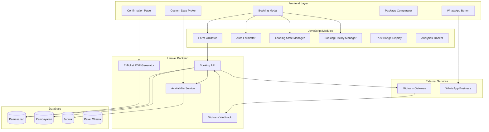
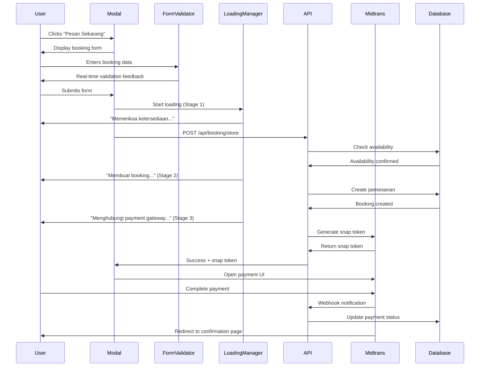

# Design Document: Booking UX Improvements

## Overview

This design document specifies the technical implementation for comprehensive UX improvements to the Godong Ijo booking system. The system will enhance the existing Laravel-based booking flow with advanced features including a dedicated confirmation page with e-ticket generation, multi-stage loading feedback, real-time form formatting, trust indicators, mobile optimization, and returning user convenience features.

### Current System Architecture

**Backend Stack:**
- Laravel 9.x (PHP 8.1+)
- MySQL database
- Midtrans payment gateway integration
- Blade templating engine

**Frontend Stack:**
- Pure JavaScript (Vanilla JS - no Alpine.js)
- Tailwind CSS for styling
- Responsive modal-based booking interface

**Existing Components:**
- `BookingController.php` - Handles booking creation and payment integration
- `booking-modal-simple.blade.php` - Modal dialog for booking form
- Database models: `Pemesanan`, `Pembayaran`, `PaketWisata`, `Jadwal`
- Guest checkout (no authentication required)

### Design Priorities

The design follows a three-tier priority system:

**Priority 1 (High Impact, Core Features):**
- Booking confirmation page with e-ticket download
- Multi-stage loading feedback
- Real-time form field formatting
- Trust and security indicators

**Priority 2 (Enhanced Experience):**
- Multi-step progress indicator
- Mobile-optimized modal
- Enhanced button interactions
- Floating WhatsApp button

**Priority 3 (Convenience Features):**
- Returning user data persistence
- Custom visual date picker
- Package comparison feature


## Architecture

### System Architecture Diagram




### Component Structure

#### Frontend Components

**1. Booking Modal (`booking-modal.js`)**
- Manages modal open/close state
- Orchestrates form submission workflow
- Integrates with all validation and formatting modules
- Handles step transitions (data entry → payment)

**2. Form Validator (`form-validator.js`)**
- Real-time client-side validation
- Inline error message display
- Field-level validation rules
- Friendly error messages in Indonesian

**3. Auto Formatter (`auto-formatter.js`)**
- Phone number formatting (0812-3456-789)
- Email domain suggestions
- Name capitalization
- Input masking

**4. Loading State Manager (`loading-manager.js`)**
- Multi-stage progress tracking
- Stage-specific messages
- Success/error animations
- Toast notifications

**5. Booking History Manager (`storage-manager.js`)**
- localStorage interface
- Data persistence with expiration
- Privacy-compliant storage
- Auto-fill functionality

**6. Trust Badge Display (`trust-badges.js`)**
- Dynamic social proof counter
- Security badge rendering
- Payment method logos
- Real-time counter updates

**7. Custom Date Picker (`date-picker.js`)**
- Visual calendar interface
- Availability indicators
- Weekend pricing display
- Mobile-optimized overlay

**8. Package Comparator (`comparator.js`)**
- Multi-select package comparison
- Side-by-side comparison table
- Feature highlighting
- Mobile horizontal scroll

**9. WhatsApp Button (`whatsapp-button.js`)**
- Scroll-triggered visibility
- Bounce animation
- Pre-filled message generation
- Modal state awareness


#### Backend Components

**1. Booking Controller (`BookingController.php`)**
- Enhanced with confirmation page route
- Multi-stage API response structure
- Validation and security checks
- Rate limiting implementation

**2. E-Ticket Generator Service (`ETicketService.php`)**
- PDF generation using dompdf or similar
- QR code generation for booking verification
- Template rendering with Blade
- File storage and retrieval

**3. Availability Service (`AvailabilityService.php`)**
- Real-time quota checking
- Date-based availability queries
- Weekend pricing logic
- Calendar data API

**4. Analytics Tracker (`AnalyticsService.php`)**
- Event logging to database
- Funnel metrics calculation
- Privacy-compliant tracking
- Aggregation queries

**5. Notification Handler (`MidtransNotificationController.php`)**
- Enhanced webhook processing
- Status synchronization
- Email/WhatsApp notifications
- Confirmation page redirect logic

### Data Flow

#### Booking Creation Flow




## Components and Interfaces

### API Endpoints

#### 1. Booking API (Enhanced)

**Endpoint:** `POST /api/booking/store`

**Request:**
```json
{
  "paket_wisata_id": 1,
  "nama_lengkap": "John Doe",
  "email": "john@example.com",
  "no_hp": "081234567890",
  "tanggal_kunjungan": "2024-12-25",
  "jumlah_orang": 2
}
```

**Response (Success):**
```json
{
  "success": true,
  "message": "Booking berhasil dibuat",
  "data": {
    "pemesanan_id": 123,
    "kode_booking": "BK20241201000123",
    "order_id": "BOOKING-123-1234567890",
    "snap_token": "xxx-xxx-xxx",
    "gross_amount": 500000,
    "paket_nama": "Paket Waterfall Adventure",
    "tanggal_kunjungan": "2024-12-25",
    "jumlah_orang": 2
  },
  "stages": {
    "availability_check": {
      "status": "success",
      "duration_ms": 150
    },
    "booking_creation": {
      "status": "success",
      "duration_ms": 200
    },
    "payment_gateway": {
      "status": "success",
      "duration_ms": 450
    }
  }
}
```

**Response (Error):**
```json
{
  "success": false,
  "message": "Kuota tidak mencukupi",
  "stage": "availability_check",
  "available_quota": 5,
  "requested": 10
}
```


#### 2. Availability API

**Endpoint:** `GET /api/availability/{paket_id}`

**Query Parameters:**
- `month`: YYYY-MM format (optional, defaults to current month)

**Response:**
```json
{
  "success": true,
  "paket_id": 1,
  "month": "2024-12",
  "dates": [
    {
      "date": "2024-12-25",
      "available": true,
      "quota_remaining": 15,
      "is_weekend": false,
      "price": 250000
    },
    {
      "date": "2024-12-30",
      "available": true,
      "quota_remaining": 10,
      "is_weekend": true,
      "price": 350000
    }
  ]
}
```

#### 3. E-Ticket Download API

**Endpoint:** `GET /booking/e-ticket/{kode_booking}`

**Response:** PDF file stream with headers:
```
Content-Type: application/pdf
Content-Disposition: attachment; filename="E-Ticket-BK20241201000123.pdf"
```

#### 4. Social Proof Counter API

**Endpoint:** `GET /api/stats/bookings-today`

**Response:**
```json
{
  "success": true,
  "count": 47,
  "last_updated": "2024-12-01T15:30:00Z"
}
```

#### 5. Confirmation Page Route

**Endpoint:** `GET /booking/confirmation/{kode_booking}`

**Response:** HTML page rendered from Blade template


### JavaScript Module Interfaces

#### Form Validator Module

```javascript
// form-validator.js
class FormValidator {
  constructor(formElement) {
    this.form = formElement;
    this.rules = this.defineRules();
    this.friendlyMessages = this.defineFriendlyMessages();
  }
  
  defineRules() {
    return {
      nama_lengkap: {
        required: true,
        minLength: 3,
        maxLength: 255,
        pattern: /^[a-zA-Z\s]+$/
      },
      email: {
        required: true,
        email: true,
        maxLength: 255
      },
      no_hp: {
        required: true,
        phone: true,
        minLength: 10,
        maxLength: 15
      },
      tanggal_kunjungan: {
        required: true,
        date: true,
        minDate: 'today'
      },
      jumlah_orang: {
        required: true,
        integer: true,
        min: 1,
        max: 100
      }
    };
  }
  
  defineFriendlyMessages() {
    return {
      nama_lengkap: {
        required: 'Kami butuh nama lengkap Anda untuk konfirmasi',
        minLength: 'Nama minimal 3 karakter ya',
        pattern: 'Nama hanya boleh berisi huruf'
      },
      email: {
        required: 'Email diperlukan untuk kirim konfirmasi',
        email: 'Email sepertinya belum benar, coba cek lagi ya!',
        maxLength: 'Email terlalu panjang'
      },
      no_hp: {
        required: 'Nomor WhatsApp diperlukan untuk konfirmasi',
        phone: 'Format nomor belum sesuai',
        minLength: 'Nomor WhatsApp minimal 10 digit agar kami bisa menghubungi Anda',
        maxLength: 'Nomor terlalu panjang'
      },
      tanggal_kunjungan: {
        required: 'Pilih tanggal kunjungan Anda',
        date: 'Format tanggal tidak valid',
        minDate: 'Tanggal tidak boleh di masa lalu'
      },
      jumlah_orang: {
        required: 'Masukkan jumlah orang',
        integer: 'Jumlah harus berupa angka',
        min: 'Minimal 1 orang',
        max: 'Maksimal 100 orang per booking'
      }
    };
  }
  
  validateField(fieldName, value) {
    // Returns { valid: boolean, message: string }
  }
  
  validateAll() {
    // Returns { valid: boolean, errors: object }
  }
  
  displayError(fieldName, message) {
    // Shows inline error below field
  }
  
  clearErrors() {
    // Removes all error messages
  }
}
```


#### Auto Formatter Module

```javascript
// auto-formatter.js
class AutoFormatter {
  constructor() {
    this.formatters = {
      phone: this.formatPhone.bind(this),
      name: this.formatName.bind(this),
      email: this.formatEmail.bind(this)
    };
  }
  
  formatPhone(value) {
    // Remove non-digits
    const cleaned = value.replace(/\D/g, '');
    
    // Format as 0812-3456-789
    if (cleaned.length <= 4) return cleaned;
    if (cleaned.length <= 8) return `${cleaned.slice(0, 4)}-${cleaned.slice(4)}`;
    return `${cleaned.slice(0, 4)}-${cleaned.slice(4, 8)}-${cleaned.slice(8, 11)}`;
  }
  
  formatName(value) {
    // Capitalize first letter of each word
    return value
      .toLowerCase()
      .split(' ')
      .map(word => word.charAt(0).toUpperCase() + word.slice(1))
      .join(' ');
  }
  
  formatEmail(value) {
    // Return lowercase email
    return value.toLowerCase();
  }
  
  getSuggestedDomains(partialEmail) {
    const domains = ['@gmail.com', '@yahoo.com', '@outlook.com', '@hotmail.com'];
    const parts = partialEmail.split('@');
    
    if (parts.length === 2 && parts[1].length > 0) {
      return domains.filter(domain => 
        domain.toLowerCase().startsWith('@' + parts[1].toLowerCase())
      );
    }
    return [];
  }
  
  attachToField(fieldElement, formatterType) {
    // Attaches formatter to input field with event listeners
  }
}
```


#### Loading State Manager Module

```javascript
// loading-manager.js
class LoadingStateManager {
  constructor(containerElement) {
    this.container = containerElement;
    this.currentStage = null;
    this.stages = {
      availability: {
        message: 'Memeriksa ketersediaan...',
        icon: '🔍'
      },
      booking: {
        message: 'Membuat booking...',
        icon: '📝'
      },
      payment: {
        message: 'Menghubungi payment gateway...',
        icon: '💳'
      }
    };
  }
  
  startLoading(stage) {
    // Display loading UI for specified stage
    this.currentStage = stage;
    this.render();
  }
  
  nextStage(stage) {
    // Transition to next stage with animation
    this.currentStage = stage;
    this.render();
  }
  
  showSuccess(message) {
    // Display success animation with checkmark
    this.renderSuccess(message);
  }
  
  showError(message, suggestedAction) {
    // Display error message with action button
    this.renderError(message, suggestedAction);
  }
  
  showToast(message, type = 'info', duration = 5000) {
    // Display toast notification
    const toast = this.createToast(message, type);
    document.body.appendChild(toast);
    setTimeout(() => toast.remove(), duration);
  }
  
  stopLoading() {
    // Remove loading UI
    this.currentStage = null;
    this.container.innerHTML = '';
  }
  
  render() {
    // Render current stage UI
  }
}
```


#### Booking History Manager Module

```javascript
// storage-manager.js
class BookingHistoryManager {
  constructor() {
    this.storageKey = 'godongijo_booking_history';
    this.expirationDays = 90;
  }
  
  saveBookingData(data) {
    const storageData = {
      nama_lengkap: data.nama_lengkap,
      email: data.email,
      no_hp: data.no_hp,
      saved_at: new Date().toISOString(),
      expires_at: this.calculateExpiration()
    };
    
    try {
      localStorage.setItem(this.storageKey, JSON.stringify(storageData));
      return true;
    } catch (e) {
      console.error('Failed to save booking data:', e);
      return false;
    }
  }
  
  getBookingData() {
    try {
      const stored = localStorage.getItem(this.storageKey);
      if (!stored) return null;
      
      const data = JSON.parse(stored);
      
      // Check expiration
      if (new Date(data.expires_at) < new Date()) {
        this.clearHistory();
        return null;
      }
      
      // Validate data
      if (this.validateStoredData(data)) {
        return {
          nama_lengkap: data.nama_lengkap,
          email: data.email,
          no_hp: data.no_hp
        };
      }
      
      return null;
    } catch (e) {
      console.error('Failed to retrieve booking data:', e);
      return null;
    }
  }
  
  validateStoredData(data) {
    // Validate email format
    const emailRegex = /^[^\s@]+@[^\s@]+\.[^\s@]+$/;
    if (!emailRegex.test(data.email)) return false;
    
    // Validate phone length
    const phoneDigits = data.no_hp.replace(/\D/g, '');
    if (phoneDigits.length < 10 || phoneDigits.length > 15) return false;
    
    return true;
  }
  
  clearHistory() {
    localStorage.removeItem(this.storageKey);
  }
  
  calculateExpiration() {
    const date = new Date();
    date.setDate(date.getDate() + this.expirationDays);
    return date.toISOString();
  }
  
  promptReuse() {
    // Returns HTML for reuse prompt
    return `
      <div class="returning-user-prompt">
        <p>Hai kembali! Gunakan data sebelumnya?</p>
        <div class="prompt-actions">
          <button class="btn-yes">Ya, pakai data saya</button>
          <button class="btn-no">Tidak, isi ulang</button>
        </div>
        <small class="privacy-notice">
          Data disimpan di browser Anda, tidak di server kami
        </small>
      </div>
    `;
  }
}
```


## Data Models

### Database Schema Changes

No schema changes are required for Priority 1-2 features. The existing tables support all functionality:

**Existing Tables:**
- `pemesanan` - Stores booking information
- `pembayaran` - Stores payment transactions
- `jadwal` - Stores schedule and availability
- `paket_wisata` - Stores tour packages

### New Table for Analytics (Optional - Priority 3)

```sql
CREATE TABLE analytics_events (
    id BIGINT UNSIGNED AUTO_INCREMENT PRIMARY KEY,
    event_type VARCHAR(50) NOT NULL,
    event_data JSON,
    user_ip VARCHAR(45),
    user_agent TEXT,
    session_id VARCHAR(100),
    created_at TIMESTAMP DEFAULT CURRENT_TIMESTAMP,
    INDEX idx_event_type (event_type),
    INDEX idx_created_at (created_at)
) ENGINE=InnoDB DEFAULT CHARSET=utf8mb4 COLLATE=utf8mb4_unicode_ci;
```

**Event Types:**
- `modal_opened`
- `modal_closed_no_submit`
- `form_field_completed`
- `validation_error`
- `booking_submitted`
- `booking_success`
- `booking_failed`
- `whatsapp_clicked`
- `autofill_accepted`
- `autofill_declined`
- `date_picker_opened`
- `comparison_viewed`
- `eticket_downloaded`

### E-Ticket Data Structure

```javascript
{
  kode_booking: "BK20241201000123",
  customer_name: "John Doe",
  email: "john@example.com",
  phone: "0812-3456-789",
  package_name: "Paket Waterfall Adventure",
  package_details: "Full day tour with guide and lunch",
  visit_date: "2024-12-25",
  visit_time: "09:00 WIB",
  number_of_guests: 2,
  total_amount: 500000,
  payment_status: "Lunas",
  payment_method: "Bank Transfer (BCA)",
  booking_date: "2024-12-01 14:30:00",
  qr_code: "base64_encoded_qr_image",
  terms_and_conditions: [
    "E-ticket ini berlaku untuk 1 kali kunjungan",
    "Tunjukkan QR code ini saat check-in",
    "Tidak dapat dipindahtangankan"
  ]
}
```


### E-Ticket PDF Service

```php
<?php
// app/Services/ETicketService.php

namespace App\Services;

use App\Models\Pemesanan;
use Barryvdh\DomPDF\Facade\Pdf;
use SimpleSoftwareIO\QrCode\Facades\QrCode;
use Illuminate\Support\Facades\Storage;

class ETicketService
{
    /**
     * Generate E-Ticket PDF for a booking
     */
    public function generate(string $kodeBooking): string
    {
        // Parse booking data
        $booking = $this->parseBookingData($kodeBooking);
        
        if (!$booking) {
            throw new \Exception("Booking not found: {$kodeBooking}");
        }
        
        // Validate required fields
        $this->validateBookingData($booking);
        
        // Generate QR code
        $qrCode = $this->generateQrCode($booking['kode_booking']);
        
        // Serialize to PDF
        $pdfPath = $this->serializeToPdf($booking, $qrCode);
        
        return $pdfPath;
    }
    
    /**
     * Parse booking data from database
     */
    private function parseBookingData(string $kodeBooking): ?array
    {
        $pemesanan = Pemesanan::with(['jadwal.paket', 'pembayaran'])
            ->where('kode_booking', $kodeBooking)
            ->first();
            
        if (!$pemesanan) {
            return null;
        }
        
        return [
            'kode_booking' => $pemesanan->kode_booking,
            'customer_name' => $pemesanan->nama_lengkap,
            'email' => $pemesanan->email,
            'phone' => $pemesanan->no_hp,
            'package_name' => $pemesanan->jadwal->paket->nama_paket ?? 'N/A',
            'package_details' => $pemesanan->jadwal->paket->deskripsi ?? '',
            'visit_date' => $pemesanan->jadwal->tanggal->format('d M Y'),
            'visit_time' => '09:00 WIB',
            'number_of_guests' => $pemesanan->jumlah_orang,
            'total_amount' => $pemesanan->total_harga,
            'payment_status' => $pemesanan->pembayaran->status ?? 'pending',
            'payment_method' => $pemesanan->pembayaran->payment_type ?? 'N/A',
            'booking_date' => $pemesanan->created_at->format('d M Y H:i:s'),
        ];
    }
    
    /**
     * Validate that all required fields are present
     */
    private function validateBookingData(array $booking): void
    {
        $requiredFields = [
            'kode_booking', 'customer_name', 'package_name',
            'visit_date', 'number_of_guests', 'total_amount'
        ];
        
        foreach ($requiredFields as $field) {
            if (empty($booking[$field])) {
                throw new \Exception("Missing required field: {$field}");
            }
        }
    }
    
    /**
     * Generate QR code containing booking code
     */
    private function generateQrCode(string $kodeBooking): string
    {
        return base64_encode(
            QrCode::format('png')
                ->size(200)
                ->margin(1)
                ->generate($kodeBooking)
        );
    }
    
    /**
     * Serialize booking data to PDF
     */
    private function serializeToPdf(array $booking, string $qrCode): string
    {
        $data = array_merge($booking, ['qr_code' => $qrCode]);
        
        $pdf = Pdf::loadView('pdf.e-ticket', $data)
            ->setPaper('a4', 'portrait')
            ->setOption('margin-top', 10)
            ->setOption('margin-bottom', 10);
            
        $filename = "E-Ticket-{$booking['kode_booking']}.pdf";
        $path = "etickets/{$filename}";
        
        Storage::put($path, $pdf->output());
        
        return $path;
    }
    
    /**
     * Download PDF
     */
    public function download(string $kodeBooking): \Symfony\Component\HttpFoundation\StreamedResponse
    {
        $pdfPath = $this->generate($kodeBooking);
        
        return Storage::download($pdfPath);
    }
}
```


### E-Ticket PDF Template (Blade)

```blade
{{-- resources/views/pdf/e-ticket.blade.php --}}
<!DOCTYPE html>
<html>
<head>
    <meta charset="utf-8">
    <title>E-Ticket - {{ $kode_booking }}</title>
    <style>
        body {
            font-family: 'DejaVu Sans', sans-serif;
            margin: 0;
            padding: 20px;
            font-size: 12px;
        }
        .header {
            text-align: center;
            border-bottom: 3px solid #059669;
            padding-bottom: 20px;
            margin-bottom: 20px;
        }
        .logo {
            font-size: 24px;
            font-weight: bold;
            color: #059669;
        }
        .booking-code {
            font-size: 28px;
            font-weight: bold;
            color: #047857;
            margin: 20px 0;
        }
        .section {
            margin-bottom: 20px;
        }
        .section-title {
            font-size: 14px;
            font-weight: bold;
            color: #374151;
            margin-bottom: 10px;
            border-bottom: 1px solid #e5e7eb;
            padding-bottom: 5px;
        }
        .info-row {
            display: flex;
            justify-content: space-between;
            padding: 8px 0;
            border-bottom: 1px dashed #e5e7eb;
        }
        .label {
            font-weight: 600;
            color: #6b7280;
        }
        .value {
            color: #111827;
            text-align: right;
        }
        .qr-section {
            text-align: center;
            margin: 30px 0;
            padding: 20px;
            background: #f9fafb;
        }
        .terms {
            font-size: 10px;
            color: #6b7280;
            margin-top: 30px;
            padding-top: 20px;
            border-top: 1px solid #e5e7eb;
        }
        .footer {
            text-align: center;
            font-size: 10px;
            color: #9ca3af;
            margin-top: 40px;
        }
    </style>
</head>
<body>
    <div class="header">
        <div class="logo">GODONG IJO - The Waterfall Resto</div>
        <p style="margin: 5px 0; color: #6b7280;">Curug Nangka, Bogor</p>
    </div>
    
    <div class="booking-code">{{ $kode_booking }}</div>
    
    <div class="section">
        <div class="section-title">Informasi Pelanggan</div>
        <div class="info-row">
            <span class="label">Nama Lengkap</span>
            <span class="value">{{ $customer_name }}</span>
        </div>
        <div class="info-row">
            <span class="label">Email</span>
            <span class="value">{{ $email }}</span>
        </div>
        <div class="info-row">
            <span class="label">No. WhatsApp</span>
            <span class="value">{{ $phone }}</span>
        </div>
    </div>
    
    <div class="section">
        <div class="section-title">Detail Pemesanan</div>
        <div class="info-row">
            <span class="label">Paket Wisata</span>
            <span class="value">{{ $package_name }}</span>
        </div>
        <div class="info-row">
            <span class="label">Tanggal Kunjungan</span>
            <span class="value">{{ $visit_date }}</span>
        </div>
        <div class="info-row">
            <span class="label">Waktu</span>
            <span class="value">{{ $visit_time }}</span>
        </div>
        <div class="info-row">
            <span class="label">Jumlah Orang</span>
            <span class="value">{{ $number_of_guests }} orang</span>
        </div>
    </div>
    
    <div class="section">
        <div class="section-title">Pembayaran</div>
        <div class="info-row">
            <span class="label">Total Pembayaran</span>
            <span class="value" style="font-size: 16px; font-weight: bold; color: #059669;">
                Rp {{ number_format($total_amount, 0, ',', '.') }}
            </span>
        </div>
        <div class="info-row">
            <span class="label">Status Pembayaran</span>
            <span class="value">{{ ucfirst($payment_status) }}</span>
        </div>
        <div class="info-row">
            <span class="label">Metode Pembayaran</span>
            <span class="value">{{ $payment_method }}</span>
        </div>
        <div class="info-row">
            <span class="label">Tanggal Booking</span>
            <span class="value">{{ $booking_date }}</span>
        </div>
    </div>
    
    <div class="qr-section">
        <p style="margin: 0 0 10px 0; font-weight: 600;">Scan QR Code saat Check-in</p>
        
    </div>
    
    <div class="terms">
        <strong>Syarat & Ketentuan:</strong>
        <ul style="margin: 5px 0; padding-left: 20px;">
            <li>E-ticket ini berlaku untuk 1 kali kunjungan sesuai tanggal yang tertera</li>
            <li>Tunjukkan QR code ini saat check-in di lokasi</li>
            <li>E-ticket tidak dapat dipindahtangankan atau diuangkan kembali</li>
            <li>Mohon datang 15 menit sebelum waktu kunjungan</li>
            <li>Pembatalan harus dilakukan minimal 24 jam sebelum tanggal kunjungan</li>
        </ul>
    </div>
    
    <div class="footer">
        <p>Terima kasih telah memilih Godong Ijo - The Waterfall Resto</p>
        <p>Untuk informasi lebih lanjut, hubungi kami via WhatsApp: 0812-xxxx-xxxx</p>
    </div>
</body>
</html>
```


## Feature Implementation Strategies

### Priority 1 Features

#### 1. Booking Confirmation Page

**Implementation Approach:**

1. **Route Configuration** (`routes/web.php`)
```php
Route::get('/booking/confirmation/{kode_booking}', 
    [BookingController::class, 'confirmation'])
    ->name('booking.confirmation');
```

2. **Controller Method**
```php
public function confirmation(string $kodeBooking)
{
    $booking = Pemesanan::with(['jadwal.paket', 'pembayaran'])
        ->where('kode_booking', $kodeBooking)
        ->firstOrFail();
    
    return view('booking.confirmation', compact('booking'));
}
```

3. **Blade Template** (`resources/views/booking/confirmation.blade.php`)
- Responsive grid layout with Tailwind CSS
- Print-friendly CSS media queries
- Social sharing meta tags
- Structured data markup for SEO

4. **Midtrans Redirect Configuration**
Update callback URL in `BookingController::store()`:
```php
'callbacks' => [
    'finish' => route('booking.confirmation', ['kode_booking' => $kodeBooking]),
],
```

**CSS Styling Approach:**
- Use Tailwind utility classes for responsive design
- Custom print styles using `@media print` queries
- Mobile-first approach with breakpoints at 640px, 768px, 1024px


#### 2. Multi-Stage Loading Feedback

**Implementation Approach:**

1. **Update BookingController API Response Structure**
```php
// Track stage timing
$stages = [
    'availability_check' => ['status' => 'pending', 'start' => microtime(true)],
    'booking_creation' => ['status' => 'pending'],
    'payment_gateway' => ['status' => 'pending']
];

// Stage 1: Availability check
$jadwal = Jadwal::firstOrCreate(...);
$stages['availability_check']['status'] = 'success';
$stages['availability_check']['duration_ms'] = 
    (microtime(true) - $stages['availability_check']['start']) * 1000;

// Stage 2: Booking creation
$stages['booking_creation']['start'] = microtime(true);
$pemesanan = Pemesanan::create(...);
$stages['booking_creation']['status'] = 'success';
$stages['booking_creation']['duration_ms'] = 
    (microtime(true) - $stages['booking_creation']['start']) * 1000;

// Stage 3: Payment gateway
$stages['payment_gateway']['start'] = microtime(true);
$snapToken = Snap::getSnapToken($params);
$stages['payment_gateway']['status'] = 'success';
$stages['payment_gateway']['duration_ms'] = 
    (microtime(true) - $stages['payment_gateway']['start']) * 1000;

return response()->json([
    'success' => true,
    'data' => [...],
    'stages' => $stages
]);
```

2. **Frontend Implementation in Modal**
```javascript
async function submitBookingForm(event) {
    event.preventDefault();
    
    const loadingManager = new LoadingStateManager(
        document.getElementById('bookingLoading')
    );
    
    // Stage 1: Availability check
    loadingManager.startLoading('availability');
    
    try {
        const response = await fetch('/api/booking/store', {
            method: 'POST',
            headers: {
                'Content-Type': 'application/json',
                'X-CSRF-TOKEN': getCsrfToken()
            },
            body: JSON.stringify(formData)
        });
        
        // Simulate minimum stage duration for better UX
        await sleep(500);
        
        // Stage 2: Booking creation
        loadingManager.nextStage('booking');
        await sleep(500);
        
        // Stage 3: Payment gateway
        loadingManager.nextStage('payment');
        
        const data = await response.json();
        
        if (data.success) {
            loadingManager.showSuccess('Booking berhasil dibuat!');
            await sleep(1000);
            
            // Open Midtrans
            window.snap.pay(data.data.snap_token, {...});
        } else {
            loadingManager.showError(
                data.message,
                'Coba lagi'
            );
        }
    } catch (error) {
        loadingManager.showError(
            'Koneksi gagal. Periksa internet Anda.',
            'Retry'
        );
    }
}
```


#### 3. Real-Time Form Field Formatting

**Implementation Approach:**

1. **Attach Auto Formatter to Modal**
```javascript
document.addEventListener('DOMContentLoaded', function() {
    const formatter = new AutoFormatter();
    
    // Phone formatting
    const phoneInput = document.getElementById('bookingPhone');
    phoneInput.addEventListener('input', (e) => {
        e.target.value = formatter.formatPhone(e.target.value);
    });
    
    // Name capitalization
    const nameInput = document.getElementById('bookingNama');
    nameInput.addEventListener('blur', (e) => {
        e.target.value = formatter.formatName(e.target.value);
    });
    
    // Email suggestions
    const emailInput = document.getElementById('bookingEmail');
    let suggestionDropdown = null;
    
    emailInput.addEventListener('input', (e) => {
        const suggestions = formatter.getSuggestedDomains(e.target.value);
        
        if (suggestions.length > 0) {
            showEmailSuggestions(emailInput, suggestions);
        } else {
            hideEmailSuggestions();
        }
    });
});

function showEmailSuggestions(input, suggestions) {
    // Create dropdown below email field
    const dropdown = document.createElement('div');
    dropdown.className = 'email-suggestions';
    dropdown.style.cssText = `
        position: absolute;
        background: white;
        border: 1px solid #e5e7eb;
        border-radius: 4px;
        box-shadow: 0 4px 6px rgba(0,0,0,0.1);
        z-index: 1000;
    `;
    
    const emailParts = input.value.split('@');
    const username = emailParts[0];
    
    suggestions.forEach(domain => {
        const option = document.createElement('div');
        option.className = 'suggestion-item';
        option.textContent = username + domain;
        option.style.cssText = 'padding: 8px 12px; cursor: pointer;';
        
        option.addEventListener('click', () => {
            input.value = username + domain;
            dropdown.remove();
        });
        
        dropdown.appendChild(option);
    });
    
    input.parentElement.appendChild(dropdown);
}
```

2. **Validation Integration**
```javascript
const validator = new FormValidator(document.getElementById('bookingForm'));

// Real-time validation on blur
document.querySelectorAll('.booking-form-input').forEach(input => {
    input.addEventListener('blur', (e) => {
        const result = validator.validateField(e.target.name, e.target.value);
        
        if (!result.valid) {
            validator.displayError(e.target.name, result.message);
            e.target.classList.add('error');
        } else {
            validator.clearErrors(e.target.name);
            e.target.classList.remove('error');
        }
    });
});
```


#### 4. Trust and Security Indicators

**Implementation Approach:**

1. **API Endpoint for Social Proof Counter**
```php
// routes/api.php
Route::get('/stats/bookings-today', [StatsController::class, 'bookingsToday']);

// app/Http/Controllers/StatsController.php
class StatsController extends Controller
{
    public function bookingsToday()
    {
        $count = Pemesanan::whereDate('created_at', today())->count();
        
        return response()->json([
            'success' => true,
            'count' => $count,
            'last_updated' => now()->toIso8601String()
        ]);
    }
}
```

2. **Trust Badge Component** (`resources/views/components/trust-badges.blade.php`)
```blade
<div class="trust-badges-container">
    {{-- SSL Badge --}}
    <div class="trust-badge">
        <svg class="w-5 h-5 text-green-600" fill="currentColor" viewBox="0 0 20 20">
            <path d="M10 2a6 6 0 00-6 6v3.586l-.707.707A1 1 0 004 14h12a1 1 0 00.707-1.707L16 11.586V8a6 6 0 00-6-6z"/>
        </svg>
        <span class="text-sm font-medium text-gray-700">Data Anda Aman 🔒</span>
    </div>
    
    {{-- Social Proof --}}
    <div class="trust-badge" id="socialProofBadge">
        <span class="text-sm text-gray-600">
            <span id="bookingCountToday" class="font-bold text-green-600">...</span> 
            orang booking hari ini
        </span>
    </div>
    
    {{-- Payment Methods --}}
    <div class="payment-methods">
        <span class="text-xs text-gray-500">Metode Pembayaran:</span>
        <div class="flex gap-2 mt-1">
            
            
            
            
        </div>
    </div>
    
    {{-- 100% Trusted Badge --}}
    <div class="trust-badge bg-green-50 border border-green-200 rounded-lg px-3 py-2">
        <div class="flex items-center gap-2">
            <svg class="w-5 h-5 text-green-600" fill="currentColor" viewBox="0 0 20 20">
                <path fill-rule="evenodd" d="M10 18a8 8 0 100-16 8 8 0 000 16zm3.707-9.293a1 1 0 00-1.414-1.414L9 10.586 7.707 9.293a1 1 0 00-1.414 1.414l2 2a1 1 0 001.414 0l4-4z"/>
            </svg>
            <span class="text-sm font-semibold text-green-700">100% Trusted</span>
        </div>
    </div>
</div>

<style>
.trust-badges-container {
    display: flex;
    flex-wrap: wrap;
    gap: 12px;
    margin: 16px 0;
    padding: 16px;
    background: #f9fafb;
    border-radius: 8px;
}

.trust-badge {
    display: flex;
    align-items: center;
    gap: 8px;
    padding: 8px 12px;
    background: white;
    border: 1px solid #e5e7eb;
    border-radius: 6px;
}

.payment-methods img {
    height: 24px;
    filter: grayscale(100%);
    opacity: 0.7;
    transition: all 0.2s;
}

.payment-methods img:hover {
    filter: grayscale(0%);
    opacity: 1;
}
</style>

<script>
// Auto-update social proof counter
async function updateSocialProof() {
    try {
        const response = await fetch('/api/stats/bookings-today');
        const data = await response.json();
        
        if (data.success) {
            document.getElementById('bookingCountToday').textContent = data.count;
        }
    } catch (error) {
        console.error('Failed to update social proof:', error);
    }
}

// Update every 60 seconds
updateSocialProof();
setInterval(updateSocialProof, 60000);
</script>
```


### Priority 2 Features

#### 5. Multi-Step Progress Indicator

**Implementation Approach:**

1. **Progress Indicator Component**
```javascript
// progress-indicator.js
class ProgressIndicator {
    constructor(container) {
        this.container = container;
        this.steps = [
            { id: 'data', label: 'Isi Data Pemesanan', completed: false },
            { id: 'payment', label: 'Pembayaran', completed: false }
        ];
        this.currentStep = 0;
    }
    
    render() {
        this.container.innerHTML = `
            <div class="progress-indicator">
                ${this.steps.map((step, index) => `
                    <div class="step ${index === this.currentStep ? 'active' : ''} 
                                     ${step.completed ? 'completed' : ''}">
                        <div class="step-number">
                            ${step.completed ? '✓' : index + 1}
                        </div>
                        <div class="step-label">
                            Step ${index + 1} of ${this.steps.length}: ${step.label}
                        </div>
                    </div>
                    ${index < this.steps.length - 1 ? `
                        <div class="step-connector ${index < this.currentStep ? 'completed' : ''}"></div>
                    ` : ''}
                `).join('')}
            </div>
        `;
    }
    
    goToStep(stepIndex, preserveData = true) {
        if (stepIndex < this.currentStep && preserveData) {
            // Going back - preserve form data
            this.preserveFormData();
        }
        
        this.currentStep = stepIndex;
        this.render();
    }
    
    completeCurrentStep() {
        this.steps[this.currentStep].completed = true;
        this.currentStep++;
        this.render();
    }
    
    preserveFormData() {
        const form = document.getElementById('bookingForm');
        const formData = new FormData(form);
        
        sessionStorage.setItem('booking_form_data', 
            JSON.stringify(Object.fromEntries(formData))
        );
    }
    
    restoreFormData() {
        const saved = sessionStorage.getItem('booking_form_data');
        if (!saved) return;
        
        const data = JSON.parse(saved);
        const form = document.getElementById('bookingForm');
        
        Object.keys(data).forEach(key => {
            const input = form.elements[key];
            if (input) input.value = data[key];
        });
    }
}
```

2. **CSS Styling**
```css
.progress-indicator {
    display: flex;
    align-items: center;
    justify-content: center;
    padding: 24px;
    background: #f9fafb;
    border-radius: 12px;
    margin-bottom: 24px;
}

.step {
    display: flex;
    flex-direction: column;
    align-items: center;
    gap: 8px;
}

.step-number {
    width: 40px;
    height: 40px;
    border-radius: 50%;
    background: #e5e7eb;
    color: #6b7280;
    display: flex;
    align-items: center;
    justify-content: center;
    font-weight: 600;
    transition: all 0.3s;
}

.step.active .step-number {
    background: #059669;
    color: white;
    box-shadow: 0 0 0 4px rgba(5, 150, 105, 0.2);
}

.step.completed .step-number {
    background: #10b981;
    color: white;
}

.step-label {
    font-size: 14px;
    color: #6b7280;
    text-align: center;
}

.step.active .step-label {
    color: #059669;
    font-weight: 600;
}

.step-connector {
    width: 80px;
    height: 2px;
    background: #e5e7eb;
    margin: 0 16px;
}

.step-connector.completed {
    background: #10b981;
}

@media (max-width: 640px) {
    .progress-indicator {
        flex-direction: column;
        gap: 16px;
    }
    
    .step-connector {
        width: 2px;
        height: 40px;
        margin: 0;
    }
}
```


#### 6. Mobile-Optimized Modal Experience

**Implementation Approach:**

1. **Responsive Modal CSS**
```css
/* Mobile-first responsive modal */
@media (max-width: 768px) {
    .booking-modal-overlay.active {
        padding: 0;
    }
    
    .booking-modal-content {
        max-width: 100%;
        width: 100%;
        max-height: 100vh;
        min-height: 100vh;
        border-radius: 0;
        display: flex;
        flex-direction: column;
    }
    
    .booking-modal-body {
        flex: 1;
        overflow-y: auto;
        padding-bottom: 80px; /* Space for sticky button */
    }
    
    /* Sticky submit button on mobile */
    .booking-submit-btn {
        position: fixed;
        bottom: 0;
        left: 0;
        right: 0;
        border-radius: 0;
        z-index: 10;
        box-shadow: 0 -4px 6px rgba(0, 0, 0, 0.1);
    }
    
    /* Minimum touch target size */
    .booking-form-input,
    .booking-submit-btn,
    .booking-modal-close,
    button {
        min-height: 44px;
        min-width: 44px;
    }
    
    /* Prevent iOS zoom on input focus */
    .booking-form-input {
        font-size: 16px;
    }
    
    /* Single column layout on mobile */
    .booking-form-row-grid {
        grid-template-columns: 1fr !important;
    }
}

/* Prevent body scroll when modal is open */
body.modal-open {
    overflow: hidden;
    position: fixed;
    width: 100%;
}
```

2. **Input Type Optimization**
```blade
{{-- Phone input with tel keyboard --}}
<input type="tel" 
       inputmode="numeric"
       pattern="[0-9]*"
       class="booking-form-input"
       id="bookingPhone"
       name="no_hp"
       placeholder="081234567890">

{{-- Email input with email keyboard --}}
<input type="email" 
       inputmode="email"
       autocomplete="email"
       class="booking-form-input"
       id="bookingEmail"
       name="email"
       placeholder="contoh@email.com">

{{-- Date input --}}
<input type="date"
       class="booking-form-input"
       id="bookingDate"
       name="tanggal_kunjungan">

{{-- Number input with numeric keyboard --}}
<input type="number"
       inputmode="numeric"
       pattern="[0-9]*"
       min="1"
       max="100"
       class="booking-form-input"
       id="bookingQty"
       name="jumlah_orang">
```

3. **Error Scrolling on Mobile**
```javascript
function scrollToFirstError() {
    const firstError = document.querySelector('.booking-form-input.error');
    
    if (firstError) {
        firstError.scrollIntoView({
            behavior: 'smooth',
            block: 'center',
            inline: 'nearest'
        });
        
        // Focus the field after scroll
        setTimeout(() => firstError.focus(), 500);
    }
}
```

