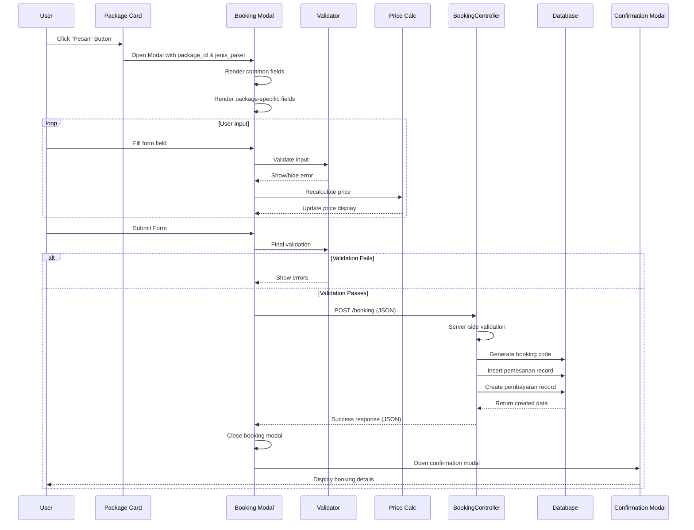

# Design Document: Dynamic Booking Form

## Overview

The Dynamic Booking Form feature introduces an intelligent, package-type-aware booking system that adapts its interface and validation logic based on three distinct tourism packages: culinary experiences (The Waterfall Resto), fishing activities (Monster Fish), and private event spaces (Private Room). The system replaces the existing generic booking form with a sophisticated modal component built using Alpine.js for reactive client-side behavior and Laravel for robust server-side processing.

### Key Design Goals

1. **Dynamic Adaptability**: Form fields automatically render based on package type without page reloads
2. **Dual-Layer Validation**: Client-side Alpine.js validation for immediate user feedback + server-side Laravel validation for security
3. **Real-Time Price Calculation**: Live price updates as users modify form inputs
4. **Extensible Architecture**: Easy to add new package types and fields in the future
5. **Mobile-First Responsiveness**: Optimized for all device sizes with touch-friendly controls
6. **Accessibility Compliance**: WCAG 2.1 Level AA standards for inclusive user experience

### Technology Stack

- **Frontend**: Alpine.js 3.x for reactive components, Blade templates for markup, Tailwind CSS 3.x for styling
- **Backend**: Laravel 10.x framework with Form Request validation
- **Database**: MySQL 8.0+ with JSON column support for flexible package-specific data storage
- **Integration**: WhatsApp Web API for booking confirmation sharing


## Architecture

### System Components

```mermaid
graph TB
    subgraph "Client Layer"
        A[Package Card] -->|Click "Pesan"| B[Alpine.js Booking Modal]
        B --> C[Dynamic Form Renderer]
        C --> D[Field Validator]
        C --> E[Price Calculator]
        B --> F[Confirmation Modal]
    end
    
    subgraph "Server Layer"
        G[BookingController] --> H[StoreBookingRequest]
        H --> I[Validation Engine]
        G --> J[Booking Service]
        J --> K[Database Layer]
    end
    
    subgraph "Database"
        K --> L[(paket_wisata)]
        K --> M[(pemesanan)]
        K --> N[(jadwal)]
        K --> O[(pembayaran)]
    end
    
    B -->|AJAX POST /booking| G
    F -->|WhatsApp Share| P[WhatsApp Web API]
    
    style B fill:#3b82f6
    style G fill:#10b981
    style K fill:#8b5cf6
```

### Component Interaction Flow



### Data Flow Architecture

1. **User Interaction Layer**: Alpine.js component manages modal state, form data, validation errors, and loading states
2. **Validation Layer**: Dual validation (client + server) ensures data integrity and user experience
3. **Business Logic Layer**: Laravel controller coordinates booking creation, price calculation, and code generation
4. **Persistence Layer**: Database transactions ensure atomic booking + payment record creation
5. **Presentation Layer**: Confirmation modal displays success state with booking details

